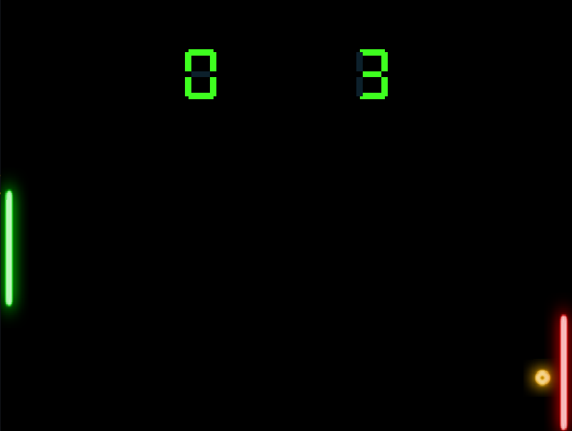

# Pong

Over-engineered pong's game implemented upon ECS pattern with Lua as script language.
The library used to manage media files and graphics was SFML, which I think that is the best one. The embedding library used was LuaBridge, the first that worked to me. 
Feel free to change Lua files and see the effects.

## Dependencies

Before anything you must install 'make' to build game.
```
sudo apt install make
```
Then install sfml libraries.
```
sudo apt install libsfml-dev
```

## Running

Before run you must compile game. 

```
make
make run
```

## Too hard!

<center>
</img>
</center>
